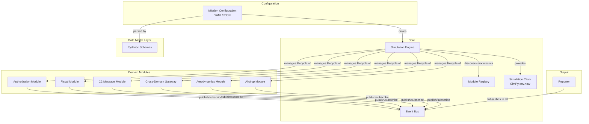
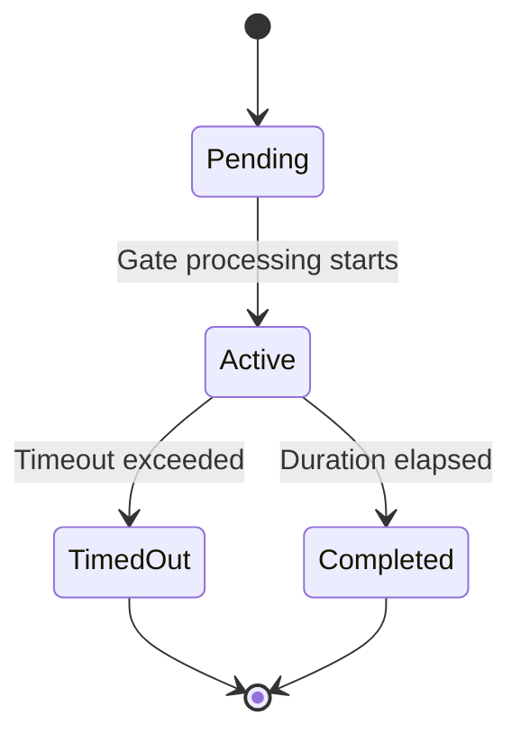
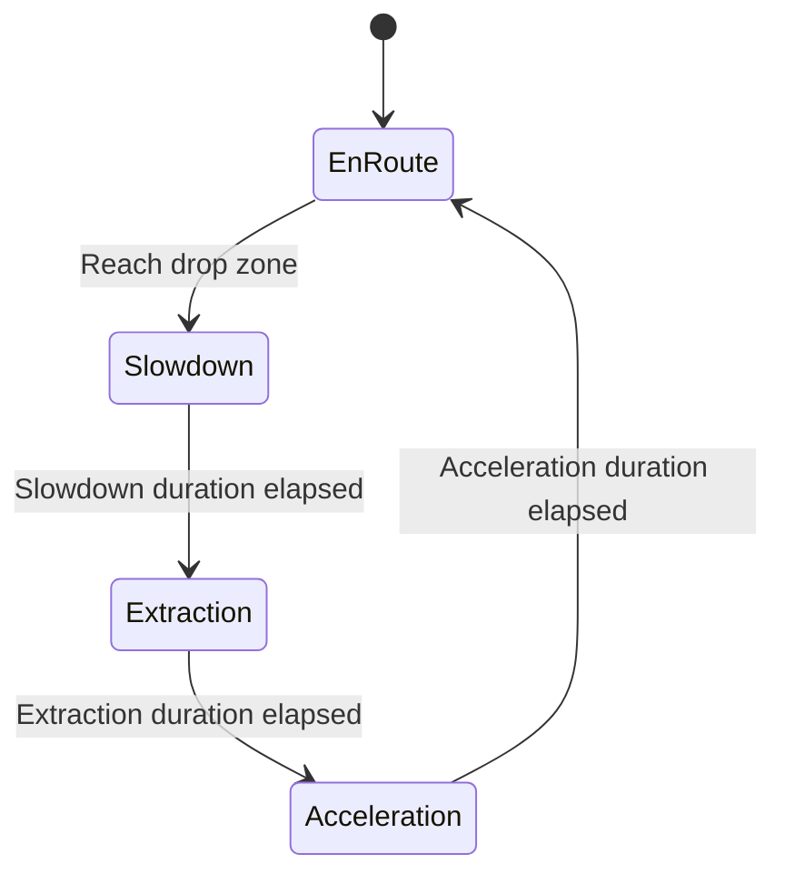
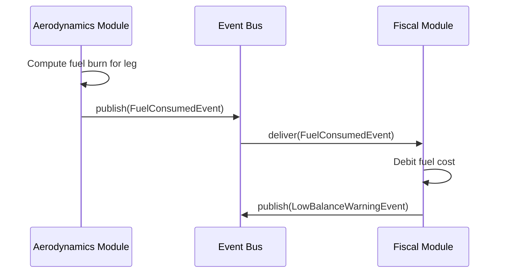

# Design Document: Modular Enterprise Simulation

## Overview

This design describes the architecture for refactoring a monolithic discrete-event enterprise simulation into a modular, pluggable framework built on Python/SimPy. The framework models large enterprises (e.g., USAF) by examining one mission at a time and analyzing the information flows that support it.

The core architectural insight is that each domain concern (authorization, fiscal, C2 messaging, cross-domain security, aerodynamics, airdrop) becomes an independent module implementing a common interface. A lightweight event bus provides inter-module communication, and a declarative mission configuration drives the assembly of modules for each simulation run. SimPy remains the scheduling backbone, but domain modules interact with it through a controlled adapter layer rather than directly coupling to SimPy internals.

### Key Design Decisions

1. **Abstract Base Class for Domain Modules** — Enforces a contract (initialize, create_processes, finalize) that the engine relies on for lifecycle management.
2. **Pydantic-only Data Model Layer** — All domain entities are defined as Pydantic models with zero SimPy dependency, enabling validation, serialization, and testing independent of the simulation runtime.
3. **Synchronous Event Bus** — Events are delivered synchronously within a single SimPy time step, preserving deterministic ordering and simplifying reasoning about event causality.
4. **Ontology-aligned class hierarchies** — Pydantic models use a superclass structure inspired by BFO/CCO/UAF (Entity → Continuant/Occurrent branching) to support future formal ontology alignment without requiring OWL/RDF tooling now.
5. **Topological initialization** — Modules declare dependencies; the engine initializes them in topological order and finalizes in reverse, providing predictable lifecycle guarantees.

## Architecture



### Package Structure

```
enterprise_sim/
├── __init__.py
├── engine/
│   ├── __init__.py
│   ├── simulation_engine.py    # SimPy env management, lifecycle orchestration
│   ├── module_registry.py      # Module discovery, validation, storage
│   └── event_bus.py            # Pub-sub event delivery
├── models/
│   ├── __init__.py
│   ├── base.py                 # Ontology-aligned base classes (Entity, Continuant, Occurrent)
│   ├── mission.py              # MissionConfiguration schema
│   ├── route.py                # RouteGraph, RouteNode, RouteEdge
│   ├── authorization.py        # AuthorizationGate, AuthorizationChain
│   ├── fiscal.py               # FiscalAccount, DebitRecord, FiscalParameters
│   ├── messaging.py            # C2MessageType, C2MessageInstance, MessageDeliveryRecord
│   ├── security.py             # SecurityEnclave, GatewayConfig, RoutingRule
│   ├── aerodynamics.py         # AircraftParameters, FuelBurnResult, BraguetConfig
│   ├── airdrop.py              # AirdropParameters, CargoManifest, AirdropState
│   └── events.py               # All event type definitions (Pydantic models)
├── modules/
│   ├── __init__.py
│   ├── base.py                 # DomainModule abstract base class
│   ├── authorization.py        # AuthorizationModule implementation
│   ├── fiscal.py               # FiscalModule implementation
│   ├── c2_message.py           # C2MessageModule implementation
│   ├── cross_domain.py         # CrossDomainGateway implementation
│   ├── aerodynamics.py         # AerodynamicsModule implementation
│   └── airdrop.py              # AirdropModule implementation
├── reporting/
│   ├── __init__.py
│   ├── reporter.py             # Event collector, timeline/metrics builder
│   └── formatters.py           # JSON and CSV output formatters
└── config/
    ├── __init__.py
    └── loader.py               # YAML/JSON config parsing and validation
```

## Components and Interfaces

### Domain Module Interface (Abstract Base Class)

```python
from abc import ABC, abstractmethod
from typing import ClassVar, Set
import simpy

class DomainModule(ABC):
    """Abstract base class that all domain modules must implement."""

    # Class-level metadata
    module_type: ClassVar[str]          # Unique identifier, e.g., "authorization"
    dependencies: ClassVar[Set[str]]    # Set of module_type identifiers this module depends on

    @abstractmethod
    def initialize(self, env: simpy.Environment, event_bus: "EventBus",
                   config: "MissionConfiguration") -> None:
        """Called during initialization phase. Set up internal state, subscribe to events.
        Must not advance simulation time."""
        ...

    @abstractmethod
    def create_processes(self, env: simpy.Environment) -> list[simpy.events.Process]:
        """Return SimPy processes that this module runs during the execution phase.
        Each process is a generator function registered with env.process()."""
        ...

    @abstractmethod
    def finalize(self) -> None:
        """Called during finalization phase. Clean up resources, flush state.
        Must not advance simulation time."""
        ...

    def validate_config(self, config: "MissionConfiguration") -> list[str]:
        """Optional: Return a list of configuration validation errors.
        Empty list means valid. Default implementation returns no errors."""
        return []
```

### Event Bus Interface

```python
from typing import Callable, Type
from models.events import SimulationEvent

class EventBus:
    """Synchronous publish-subscribe event bus."""

    def publish(self, event: SimulationEvent) -> None:
        """Deliver event to all subscribers of this event type synchronously."""
        ...

    def subscribe(self, event_type: Type[SimulationEvent],
                  handler: Callable[[SimulationEvent], None],
                  subscriber_id: str) -> None:
        """Register a handler for a specific event type."""
        ...

    def subscribe_all(self, handler: Callable[[SimulationEvent], None],
                      subscriber_id: str) -> None:
        """Register a handler that receives ALL event types (used by Reporter)."""
        ...
```

### Module Registry Interface

```python
class ModuleRegistry:
    """Validates and stores Domain Module implementations."""

    def register(self, module: DomainModule) -> None:
        """Register a module. Raises RegistrationError if:
        - module doesn't implement required interface methods
        - module_type already exists in registry"""
        ...

    def get(self, module_type: str) -> DomainModule | None:
        """Retrieve a module by type identifier. Returns None if not found."""
        ...

    def get_all(self) -> list[DomainModule]:
        """Return all registered modules."""
        ...

    def resolve_initialization_order(self) -> list[DomainModule]:
        """Topological sort of modules by declared dependencies.
        Raises CycleError if circular dependencies detected."""
        ...
```

### Simulation Engine Interface

```python
class SimulationEngine:
    """Orchestrates the simulation lifecycle."""

    def __init__(self, registry: ModuleRegistry, event_bus: EventBus) -> None: ...

    def load_configuration(self, config: MissionConfiguration) -> list[str]:
        """Validate config against registry. Returns list of errors (empty = valid)."""
        ...

    def run(self, config: MissionConfiguration) -> SimulationResult:
        """Execute the full initialization → execution → finalization lifecycle."""
        ...
```

### Reporter Interface

```python
class Reporter:
    """Collects events and produces structured output."""

    def __init__(self, event_bus: EventBus) -> None:
        """Subscribe to all events on the bus."""
        ...

    def get_timeline(self) -> list[TimelineEntry]:
        """Return ordered timeline of all events."""
        ...

    def get_metrics(self) -> SummaryMetrics:
        """Compute summary metrics from collected events."""
        ...

    def export(self, format: str = "json") -> str:
        """Export results in the specified format."""
        ...
```

## Data Models

### Ontology-Aligned Base Classes

The data model layer uses a class hierarchy inspired by Basic Formal Ontology (BFO) and Common Core Ontologies (CCO), structured to support future formal ontology alignment without requiring OWL/RDF tooling at this stage.

```python
from pydantic import BaseModel, Field
from typing import Optional
from datetime import datetime
from enum import Enum

# === BFO-aligned root hierarchy ===

class Entity(BaseModel):
    """Root of the ontology hierarchy. Corresponds to BFO:Entity."""
    entity_id: str = Field(..., description="Unique identifier")
    entity_type: str = Field(..., description="Discriminator for subclass")

class Continuant(Entity):
    """Entities that persist through time and maintain identity.
    Corresponds to BFO:Continuant. Includes objects, roles, qualities."""
    entity_type: str = "continuant"

class Occurrent(Entity):
    """Entities that unfold in time (processes, events).
    Corresponds to BFO:Occurrent."""
    entity_type: str = "occurrent"
    timestamp: float = Field(..., ge=0, description="Simulation time")

# === CCO/UAF-aligned domain specializations ===

class InformationEntity(Continuant):
    """Information content entities (messages, documents, configurations).
    Corresponds to CCO:InformationContentEntity."""
    entity_type: str = "information_entity"
    classification: Optional[str] = None

class Agent(Continuant):
    """Agents that bear roles and participate in processes.
    Corresponds to CCO:Agent / UAF:PerformerRole."""
    entity_type: str = "agent"

class SpatialRegion(Continuant):
    """Geographic or spatial locations.
    Corresponds to BFO:SpatialRegion."""
    entity_type: str = "spatial_region"
    latitude: Optional[float] = None
    longitude: Optional[float] = None
    altitude_ft: Optional[float] = None

class Process(Occurrent):
    """A process that unfolds over time with a start and end.
    Corresponds to BFO:Process."""
    entity_type: str = "process"
    start_time: float = Field(..., ge=0)
    end_time: Optional[float] = Field(None, ge=0)
```

### Mission Configuration Schema

```python
from pydantic import BaseModel, Field, model_validator
from typing import Optional

class MissionConfiguration(BaseModel):
    """Top-level declarative mission specification."""
    mission_id: str
    mission_name: str
    route_graph: RouteGraphConfig
    aircraft: AircraftConfig
    authorization_chain: Optional[AuthorizationChainConfig] = None
    fiscal_parameters: Optional[FiscalConfig] = None
    c2_messages: Optional[C2MessageConfig] = None
    cross_domain_gateway: Optional[CrossDomainGatewayConfig] = None
    airdrop_parameters: Optional[AirdropConfig] = None
    active_modules: list[str] = Field(
        default_factory=list,
        description="Module type identifiers to activate for this mission"
    )
```

### Route Graph Schema

```python
class RouteNode(SpatialRegion):
    """A waypoint in the mission route graph."""
    entity_type: str = "route_node"
    name: str = Field(..., min_length=1)
    node_type: Optional[str] = None  # e.g., "waypoint", "drop_zone", "base"

class RouteEdge(BaseModel):
    """A directed edge between route nodes."""
    source: str
    destination: str
    distance_nm: float = Field(..., gt=0, description="Distance in nautical miles")
    airspace_classification: Optional[str] = None

class RouteGraphConfig(BaseModel):
    """Directed graph of spatial nodes."""
    nodes: list[RouteNode] = Field(..., min_length=2)
    edges: list[RouteEdge] = Field(..., min_length=1)
    origin: str
    destination: str

    @model_validator(mode="after")
    def validate_graph_structure(self) -> "RouteGraphConfig":
        # Validates: unique node names, origin/destination exist,
        # path exists from origin to destination,
        # no non-destination dead-end nodes
        ...
```

### Authorization Models

```python
class AuthorizationGate(Process):
    """A single authorization gate with processing duration."""
    entity_type: str = "authorization_gate"
    gate_name: str
    duration: float = Field(..., gt=0, description="Processing time in sim units")
    timeout: Optional[float] = Field(None, gt=0)
    status: str = "pending"  # pending | active | completed | failed | timed_out

class AuthorizationChainConfig(BaseModel):
    """Configuration for an authorization chain."""
    chain_id: str
    chain_type: str = Field(..., pattern="^(sequential|parallel)$")
    gates: list[AuthorizationGate] = Field(..., min_length=1)
```

### Fiscal Models

```python
class FiscalAccount(Continuant):
    """A fiscal account with balance tracking."""
    entity_type: str = "fiscal_account"
    account_id: str
    initial_allocation: float = Field(..., gt=0)
    current_balance: float = Field(..., ge=0)
    warning_threshold_pct: float = Field(0.1, ge=0, le=1)

class DebitRecord(Occurrent):
    """A single debit line item."""
    entity_type: str = "debit_record"
    account_id: str
    amount: float = Field(..., gt=0)
    cost_category: str  # "flying_hour" | "fuel" | "other"
    balance_after: float

class FiscalConfig(BaseModel):
    """Mission fiscal configuration."""
    accounts: list[FiscalAccount]
    cost_per_flying_hour: float = Field(..., gt=0)
    cost_per_fuel_unit: float = Field(..., gt=0)
```

### C2 Messaging Models

```python
class C2MessageType(InformationEntity):
    """Definition of a C2 message type."""
    entity_type: str = "c2_message_type"
    name: str
    source_node: str
    destination_node: str
    priority: int = Field(..., ge=1)
    transmission_latency: float = Field(..., ge=0)

class C2MessageInstance(Occurrent):
    """A specific instance of a C2 message in the simulation."""
    entity_type: str = "c2_message_instance"
    message_type: str
    generation_time: float = Field(..., ge=0)
    transmission_start_time: Optional[float] = None
    delivery_time: Optional[float] = None
    status: str = "generated"  # generated | in_transit | delivered | failed
```

### Cross-Domain Security Models

```python
class SecurityEnclave(Continuant):
    """A security domain/enclave."""
    entity_type: str = "security_enclave"
    name: str
    classification_level: str  # e.g., "UNCLASSIFIED", "SECRET", "TOP_SECRET"

class RoutingRule(BaseModel):
    """Permit/deny rule for cross-domain message transfer."""
    source_enclave: str
    destination_enclave: str
    permitted_classifications: list[str]

class CrossDomainGatewayConfig(BaseModel):
    """Configuration for a cross-domain gateway."""
    sanitization_latency: float = Field(..., ge=0)
    enclaves: list[SecurityEnclave] = Field(..., min_length=2)
    routing_rules: list[RoutingRule]
```

### Aerodynamics Models

```python
class AircraftConfig(Continuant):
    """Aircraft parameters for aerodynamic computation."""
    entity_type: str = "aircraft"
    aircraft_type: str
    lift_to_drag_ratio: float = Field(..., gt=0)
    specific_fuel_consumption: float = Field(..., gt=0)
    initial_fuel_weight: float = Field(..., gt=0)
    max_fuel_capacity: float = Field(..., gt=0)

class FuelBurnResult(Occurrent):
    """Result of fuel-burn computation for one leg."""
    entity_type: str = "fuel_burn_result"
    leg_source: str
    leg_destination: str
    fuel_consumed: float = Field(..., ge=0)
    remaining_fuel: float = Field(..., ge=0)
```

### Airdrop Models

```python
class AirdropPhase(str, Enum):
    EN_ROUTE = "en_route"
    SLOWDOWN = "slowdown"
    EXTRACTION = "extraction"
    ACCELERATION = "acceleration"

class AirdropConfig(BaseModel):
    """Airdrop parameters from mission configuration."""
    extraction_speed: float = Field(..., gt=0)
    drop_altitude_ft: float = Field(..., gt=0)
    cargo_weight_limit: float = Field(..., gt=0)
    phase_durations: dict[AirdropPhase, float]  # Each must be > 0
    cargo_manifest: list[CargoItem]

class CargoItem(BaseModel):
    """A single cargo item in the manifest."""
    item_id: str
    weight: float = Field(..., gt=0)
    description: str

class AirdropState(Occurrent):
    """Current state of aircraft during airdrop operations."""
    entity_type: str = "airdrop_state"
    current_phase: AirdropPhase
    drop_zone_id: str
```

### Event Type Definitions

```python
class SimulationEvent(Occurrent):
    """Base class for all simulation events."""
    entity_type: str = "simulation_event"
    event_type: str
    source_module: str

# Authorization events
class GateCompletionEvent(SimulationEvent):
    event_type: str = "gate_completion"
    gate_name: str
    chain_id: str

class GateTimeoutEvent(SimulationEvent):
    event_type: str = "gate_timeout"
    gate_name: str
    chain_id: str

class ChainCompletionEvent(SimulationEvent):
    event_type: str = "chain_completion"
    chain_id: str
    elapsed_time: float

# Fiscal events
class FundsExhaustedEvent(SimulationEvent):
    event_type: str = "funds_exhausted"
    account_id: str
    requested_amount: float
    current_balance: float

class LowBalanceWarningEvent(SimulationEvent):
    event_type: str = "low_balance_warning"
    account_id: str
    current_balance: float
    threshold_pct: float

# C2 Messaging events
class MessageDeliveryFailureEvent(SimulationEvent):
    event_type: str = "message_delivery_failure"
    message_type: str
    source: str
    intended_destination: str
    generation_time: float

# Cross-domain events
class ClassificationViolationEvent(SimulationEvent):
    event_type: str = "classification_violation"
    message_id: str
    source_enclave: str
    destination_enclave: str
    message_classification: str

class SanitizationCompleteEvent(SimulationEvent):
    event_type: str = "sanitization_complete"
    sanitization_duration: float
    source_enclave: str
    destination_enclave: str

# Aerodynamics events
class FuelConsumedEvent(SimulationEvent):
    event_type: str = "fuel_consumed"
    leg_id: str
    fuel_quantity: float

class FuelInsufficientEvent(SimulationEvent):
    event_type: str = "fuel_insufficient"
    leg_id: str
    required_fuel: float
    available_fuel: float

# Airdrop events
class ExtractionStartEvent(SimulationEvent):
    event_type: str = "extraction_start"
    drop_zone_id: str

class ExtractionCompleteEvent(SimulationEvent):
    event_type: str = "extraction_complete"
    drop_zone_id: str
    cargo_manifest: list[str]

class WeightExceededEvent(SimulationEvent):
    event_type: str = "weight_exceeded"
    cargo_weight: float
    weight_limit: float
```


## Correctness Properties

*A property is a characteristic or behavior that should hold true across all valid executions of a system — essentially, a formal statement about what the system should do. Properties serve as the bridge between human-readable specifications and machine-verifiable correctness guarantees.*

### Property 1: Module Registration Validation Completeness

*For any* object submitted for registration as a Domain_Module, the Module_Registry SHALL accept it if and only if it implements all required interface methods (initialize, create_processes, finalize), and when rejected, the error SHALL identify every missing or non-compliant method.

**Validates: Requirements 1.2, 1.5**

### Property 2: Mission Configuration Round-Trip

*For any* valid MissionConfiguration object, serializing to JSON and parsing back SHALL produce an object with field-by-field equality to the original, including all nested entities and collection fields.

**Validates: Requirements 2.5**

### Property 3: Missing Module Detection Completeness

*For any* MissionConfiguration referencing a set of module types, and a Module_Registry containing a subset of those types, the validation error SHALL list exactly the set of module types that are referenced but not present in the registry.

**Validates: Requirements 2.2, 2.3**

### Property 4: Configuration Validation Error Aggregation

*For any* Pydantic model construction attempt with multiple invalid field values, the raised ValidationError SHALL identify all violating fields and their specific constraint failures, not just the first encountered.

**Validates: Requirements 2.6, 3.2, 3.4**

### Property 5: Data Model Serialization Round-Trip

*For any* valid Data_Model_Layer entity (across all entity types), serializing to JSON and deserializing SHALL produce an entity with field-by-field equality to the original, including nested entities and collection fields.

**Validates: Requirements 3.3, 3.5**

### Property 6: Route Graph Round-Trip

*For any* valid RouteGraphConfig, serializing then deserializing SHALL produce a graph with identical node sets (names, types, coordinates) and edge sets (source, destination, distance).

**Validates: Requirements 9.5**

### Property 7: Route Graph Dead-End Detection

*For any* directed graph where a non-destination node has no outbound edges, validation SHALL return an error identifying that specific disconnected node.

**Validates: Requirements 9.2, 9.3**

### Property 8: Authorization Chain Timing

*For any* authorization chain, sequential chains SHALL complete in total time equal to the sum of gate durations, and parallel chains SHALL complete in total time equal to the maximum gate duration.

**Validates: Requirements 4.3, 4.6**

### Property 9: Authorization Gate Timeout Cascading

*For any* authorization gate where the configured timeout is less than the gate duration, the gate SHALL transition to a failed state, all dependent gates SHALL be cancelled, and a timeout event SHALL be published containing the gate name and chain identifier.

**Validates: Requirements 4.5**

### Property 10: Fiscal Balance Invariant

*For any* fiscal account after a sequence of debit operations, the current_balance SHALL equal the initial_allocation minus the sum of all successful debit amounts, and the cumulative_debits counter SHALL equal the sum of all successful debit amounts.

**Validates: Requirements 5.1, 5.6**

### Property 11: Fiscal Overdraft Prevention

*For any* fiscal account and debit amount where the debit exceeds the current balance, the balance SHALL remain unchanged after the operation, and a funds-exhausted event SHALL be published with the account identifier, requested amount, and current balance.

**Validates: Requirements 5.3**

### Property 12: Fiscal Cost Computation

*For any* flying-hour quantity and fuel quantity, the computed cost line items SHALL equal (hours × cost_per_flying_hour) and (fuel × cost_per_fuel_unit) respectively, recorded as separate line items with correct cost categories.

**Validates: Requirements 5.2, 5.4**

### Property 13: Fiscal Low-Balance Warning

*For any* fiscal account where the current balance is below (warning_threshold_pct × initial_allocation), every subsequent successful debit SHALL trigger a low-balance warning event.

**Validates: Requirements 5.5**

### Property 14: C2 Message Delivery Timing

*For any* C2 message routed to a reachable destination without crossing a gateway, the delivery_time SHALL equal generation_time + transmission_latency, and all three timestamps (generation, transmission_start, delivery) SHALL satisfy generation ≤ transmission_start ≤ delivery.

**Validates: Requirements 6.2, 6.3**

### Property 15: C2 Message Cross-Domain Latency Composition

*For any* C2 message traversing a Cross_Domain_Gateway with a permitted classification, the total delivery time SHALL equal transmission_latency + sanitization_latency, and a sanitization-complete event SHALL be published with the correct duration.

**Validates: Requirements 6.5, 7.1, 7.4**

### Property 16: C2 Message Failure Handling

*For any* C2 message directed to a destination not present in the configuration, the module SHALL publish a message-delivery-failure event containing the message type, source, intended destination, and generation timestamp, and SHALL retain the generation and transmission-start timestamps on the message record.

**Validates: Requirements 6.4, 6.6**

### Property 17: Cross-Domain Gateway Routing Rule Enforcement

*For any* message, source enclave, destination enclave, and set of routing rules, the gateway SHALL permit transfer if and only if the message classification appears in the permitted_classifications for that (source, destination) enclave pair. When denied, the gateway SHALL publish a classification-violation event and discard the message.

**Validates: Requirements 7.2, 7.3**

### Property 18: Aerodynamic Fuel Accounting Invariant

*For any* sequence of flight legs with an aircraft configuration, the cumulative fuel consumed SHALL equal the sum of individual Breguet-computed fuel burns for each leg, and the remaining fuel after each leg SHALL equal (initial_fuel_weight − cumulative_fuel_consumed).

**Validates: Requirements 8.1, 8.2, 8.7**

### Property 19: Fuel Insufficiency Detection

*For any* flight leg where the computed fuel-burn exceeds the aircraft's remaining fuel (initial minus cumulative prior consumption), the Aerodynamics_Module SHALL publish a fuel-insufficient event before the leg begins, containing the required fuel and available fuel.

**Validates: Requirements 8.5**

### Property 20: Aircraft Parameter Validation

*For any* aircraft parameter set where one or more values (lift_to_drag_ratio, specific_fuel_consumption, initial_fuel_weight, max_fuel_capacity) are non-positive, the Aerodynamics_Module SHALL reject the configuration and identify the invalid parameter(s).

**Validates: Requirements 8.4, 8.6**

### Property 21: Airdrop State Machine Exclusivity

*For any* airdrop operation with configurable phase durations, at every simulation time point the aircraft SHALL occupy exactly one phase from the ordered sequence (en-route → slowdown → extraction → acceleration → en-route), and the total time in each phase SHALL equal its configured duration.

**Validates: Requirements 11.1**

### Property 22: Airdrop Weight Limit Enforcement

*For any* cargo manifest where total weight exceeds the configured cargo weight limit, the Airdrop_Module SHALL prevent the state transition sequence from starting (aircraft remains in en-route) and publish a weight-exceeded event with the cargo weight and limit.

**Validates: Requirements 11.6**

### Property 23: Airdrop Event Lifecycle

*For any* successful airdrop extraction sequence, the module SHALL publish an extraction-start event at the beginning of the extraction phase (with drop_zone_id), and an extraction-complete event at its end (with cargo manifest), and the extraction duration SHALL equal the configured extraction phase duration.

**Validates: Requirements 11.3, 11.4**

### Property 24: Event Bus Synchronous Delivery

*For any* set of subscribers registered for an event type, publishing an event SHALL deliver to all subscribers before the publish call returns, and delivery SHALL occur in subscription registration order.

**Validates: Requirements 10.2, 10.3**

### Property 25: Event Bus Fault Isolation

*For any* set of subscribers where one raises an exception during handling, the event SHALL still be delivered to all remaining subscribers in their original order, and the exception SHALL be logged with subscriber identifier and event type.

**Validates: Requirements 10.5**

### Property 26: Event Bus Subscription Timing

*For any* subscriber that registers for an event type, it SHALL receive all events of that type published after registration, and SHALL NOT receive events published before registration.

**Validates: Requirements 10.6**

### Property 27: Reporter Event Completeness and Ordering

*For any* set of events published to the Event_Bus during a simulation run, the Reporter's timeline SHALL contain all published events, ordered by simulation timestamp, with publication order preserved for events sharing the same timestamp.

**Validates: Requirements 12.1, 12.2, 12.7**

### Property 28: Reporter Metrics Computation

*For any* set of simulation events, the Reporter's summary metrics SHALL produce: total_duration equal to the maximum timestamp, total_costs equal to the sum of all fiscal debit amounts, message_count_sent/delivered/failed matching actual event counts, and mean_delivery_time computed from delivered message timestamps.

**Validates: Requirements 12.3**

### Property 29: Module Lifecycle Ordering

*For any* set of Domain_Modules with a valid (acyclic) dependency graph, the Simulation_Engine SHALL call initialize in a topological order consistent with declared dependencies, and finalize in the exact reverse of initialization order.

**Validates: Requirements 13.2, 13.3**

### Property 30: Initialization Failure Cleanup

*For any* set of Domain_Modules where one fails during initialization, the Simulation_Engine SHALL call finalize on all previously-initialized modules (those initialized before the failure) in reverse initialization order, and return an error identifying the failed module.

**Validates: Requirements 13.4**

### Property 31: Finalization Fault Tolerance

*For any* set of Domain_Modules where one or more raise exceptions during finalization, the Simulation_Engine SHALL continue finalizing all remaining modules in order, logging each error without halting.

**Validates: Requirements 13.7**

### Property 32: Dependency Cycle Detection

*For any* set of declared module dependencies that form a cycle, the Simulation_Engine SHALL reject the configuration and return an error identifying the modules involved in the cycle.

**Validates: Requirements 13.6**

## Error Handling

### Strategy

Error handling follows a **fail-fast on configuration, graceful-degrade on runtime** philosophy:

1. **Configuration Errors (Fail Fast)**
   - Invalid mission configurations, missing required fields, out-of-range values → raise `ValidationError` with all violations aggregated
   - Duplicate module registration → raise `RegistrationError`
   - Circular dependencies → raise `CycleError`
   - Invalid route graphs (dead ends, missing paths) → raise `GraphValidationError`
   - All configuration errors halt before simulation execution begins

2. **Runtime Errors (Graceful Degradation)**
   - Missing module referenced in config → skip silently (Req 1.4)
   - Subscriber exception during event handling → log, skip, continue delivery (Req 10.5)
   - Module exception during finalization → log, continue finalizing others (Req 13.7)
   - Unreachable message destination → publish failure event, discard message (Req 6.4)
   - Insufficient fuel → publish warning event, continue simulation (Req 8.5)
   - Funds exhausted → publish event, reject debit, continue (Req 5.3)

3. **Initialization Failure (Controlled Shutdown)**
   - Module raises during initialize → finalize all prior modules in reverse order, halt with error (Req 13.4)

### Exception Hierarchy

```python
class SimulationError(Exception):
    """Base exception for all simulation errors."""

class ConfigurationError(SimulationError):
    """Invalid mission or module configuration."""
    invalid_fields: list[str]
    violations: list[str]

class RegistrationError(SimulationError):
    """Module registration failure."""
    module_name: str
    missing_methods: list[str]

class CycleError(SimulationError):
    """Circular dependency detected."""
    cycle_modules: list[str]

class GraphValidationError(SimulationError):
    """Route graph structural error."""
    node_name: str
    reason: str
```

## Testing Strategy

### Dual Testing Approach

This feature is well-suited to property-based testing because:
- The domain has pure computational logic (Breguet equation, cost computation, graph validation)
- Data models have round-trip serialization requirements
- Event bus has universal delivery guarantees
- State machines have invariants that must hold for all inputs
- The input space for configurations, messages, and module combinations is large

**Property-Based Testing Library**: [Hypothesis](https://hypothesis.readthedocs.io/) for Python

**Configuration**:
- Minimum 100 iterations per property test
- Each property test tagged with: `# Feature: modular-enterprise-simulation, Property {N}: {title}`
- Custom strategies for generating valid MissionConfiguration, RouteGraph, and domain-specific objects

### Unit Tests (Example-Based)

Focus on:
- Specific lifecycle scenarios (Req 13.1, 13.5)
- Schema structure verification (Req 2.1, 6.1, 9.4, 11.5)
- Edge cases: zero modules (Req 1.3), zero events (Req 12.6), no subscribers (Req 10.4)
- Breguet equation against known reference values (Req 8.3)
- Airdrop trigger on drop zone arrival (Req 11.2)
- Format output correctness for JSON/CSV (Req 12.4)

### Integration Tests

Focus on:
- Full lifecycle with multiple interacting modules
- Authorization blocking downstream processes (Req 4.4)
- End-to-end message routing through cross-domain gateway
- Airdrop triggered by route graph progression
- Reporter capturing a complete simulation run

### Custom Hypothesis Strategies

```python
from hypothesis import strategies as st

# Strategy for valid route graphs
valid_route_graphs = st.builds(
    RouteGraphConfig,
    nodes=st.lists(st.builds(RouteNode, ...), min_size=2, max_size=10),
    edges=...,  # Ensure path from origin to destination
)

# Strategy for fiscal accounts
valid_fiscal_accounts = st.builds(
    FiscalAccount,
    initial_allocation=st.floats(min_value=1.0, max_value=1e9),
    ...
)

# Strategy for authorization chains
valid_auth_chains = st.builds(
    AuthorizationChainConfig,
    chain_type=st.sampled_from(["sequential", "parallel"]),
    gates=st.lists(st.builds(AuthorizationGate, duration=st.floats(min_value=0.01, max_value=1000)), min_size=1),
)
```

### Test Organization

```
tests/
├── unit/
│   ├── test_models/           # Pydantic model construction, validation
│   ├── test_engine/           # Engine lifecycle, registry, event bus
│   └── test_modules/          # Individual module logic
├── property/
│   ├── test_roundtrip.py      # Properties 2, 5, 6 (serialization round-trips)
│   ├── test_validation.py     # Properties 1, 3, 4, 7, 20 (validation correctness)
│   ├── test_event_bus.py      # Properties 24, 25, 26 (event bus guarantees)
│   ├── test_authorization.py  # Properties 8, 9 (chain timing, timeout)
│   ├── test_fiscal.py         # Properties 10, 11, 12, 13 (fiscal invariants)
│   ├── test_messaging.py      # Properties 14, 15, 16, 17 (C2 + gateway)
│   ├── test_aerodynamics.py   # Properties 18, 19 (fuel accounting)
│   ├── test_airdrop.py        # Properties 21, 22, 23 (state machine)
│   ├── test_reporter.py       # Properties 27, 28 (event collection)
│   └── test_lifecycle.py      # Properties 29, 30, 31, 32 (engine lifecycle)
└── integration/
    ├── test_full_mission.py   # End-to-end mission scenarios
    └── test_module_interaction.py  # Multi-module integration
```

## Domain Module Internal Designs

### Authorization Module



**Internal State:**
- `chain_config: AuthorizationChainConfig` — the chain being processed
- `gate_states: dict[str, str]` — per-gate status tracking
- `start_times: dict[str, float]` — when each gate began processing

**SimPy Process Pattern:**
```python
def _process_sequential_chain(self, env: simpy.Environment):
    for gate in self.chain_config.gates:
        self.gate_states[gate.gate_name] = "active"
        self.start_times[gate.gate_name] = env.now
        # Race between completion and timeout
        completion = env.timeout(gate.duration)
        timeout_ev = env.timeout(gate.timeout) if gate.timeout else None
        if timeout_ev:
            result = yield completion | timeout_ev
            if timeout_ev in result:
                self._handle_timeout(gate)
                return
        else:
            yield completion
        self.gate_states[gate.gate_name] = "completed"
        self.event_bus.publish(GateCompletionEvent(...))
    self.event_bus.publish(ChainCompletionEvent(...))

def _process_parallel_chain(self, env: simpy.Environment):
    processes = [env.process(self._process_single_gate(env, gate))
                 for gate in self.chain_config.gates]
    yield simpy.events.AllOf(env, processes)
    if all(s == "completed" for s in self.gate_states.values()):
        self.event_bus.publish(ChainCompletionEvent(...))
```

### Fiscal Module

**Internal State:**
- `accounts: dict[str, FiscalAccount]` — live account state
- `debit_log: list[DebitRecord]` — append-only debit history
- `cumulative_debits: dict[str, float]` — running totals per account

**Key Methods:**
```python
def debit(self, account_id: str, amount: float, category: str, timestamp: float) -> bool:
    account = self.accounts[account_id]
    if account.current_balance - amount < 0:
        self.event_bus.publish(FundsExhaustedEvent(...))
        return False
    account.current_balance -= amount
    self.cumulative_debits[account_id] += amount
    self.debit_log.append(DebitRecord(...))
    if account.current_balance < account.warning_threshold_pct * account.initial_allocation:
        self.event_bus.publish(LowBalanceWarningEvent(...))
    return True

def compute_flying_hour_cost(self, hours: float) -> float:
    return hours * self.config.cost_per_flying_hour

def compute_fuel_cost(self, fuel_units: float) -> float:
    return fuel_units * self.config.cost_per_fuel_unit
```

**SimPy Integration:** The Fiscal Module does not run its own SimPy process. It exposes the `debit()` method called by other modules (Aerodynamics for fuel costs) during their processes. It subscribes to relevant events via the Event Bus for passive cost tracking.

### C2 Message Module

**Internal State:**
- `message_types: dict[str, C2MessageType]` — configured message definitions
- `message_log: list[C2MessageInstance]` — all message instances
- `gateway_ref: CrossDomainGateway | None` — reference for cross-domain latency

**SimPy Process Pattern:**
```python
def _message_flow_process(self, env: simpy.Environment, msg_type: C2MessageType):
    instance = C2MessageInstance(
        message_type=msg_type.name,
        generation_time=env.now,
        timestamp=env.now,
    )
    instance.transmission_start_time = env.now
    
    # Check destination validity
    if not self._is_destination_reachable(msg_type.destination_node):
        instance.status = "failed"
        self.event_bus.publish(MessageDeliveryFailureEvent(...))
        self.message_log.append(instance)
        return
    
    # Apply transmission latency
    total_latency = msg_type.transmission_latency
    
    # Add gateway latency if crossing domains
    if self._crosses_domain_boundary(msg_type):
        gateway_latency = self.gateway_ref.get_sanitization_latency(...)
        if gateway_latency is None:  # Classification violation
            instance.status = "failed"
            self.message_log.append(instance)
            return
        total_latency += gateway_latency
    
    yield env.timeout(total_latency)
    instance.delivery_time = env.now
    instance.status = "delivered"
    self.message_log.append(instance)
```

### Cross-Domain Gateway Module

**Internal State:**
- `enclaves: dict[str, SecurityEnclave]` — enclave definitions
- `routing_rules: dict[tuple[str, str], list[str]]` — (src, dst) → permitted classifications
- `sanitization_latency: float`

**Key Methods:**
```python
def check_routing(self, message_classification: str,
                  source_enclave: str, dest_enclave: str) -> bool:
    """Return True if the classification is permitted for this enclave pair."""
    key = (source_enclave, dest_enclave)
    if key not in self.routing_rules:
        return False
    return message_classification in self.routing_rules[key]

def process_message(self, env: simpy.Environment, message_id: str,
                    classification: str, source: str, dest: str):
    """SimPy process: apply sanitization or deny."""
    if not self.check_routing(classification, source, dest):
        self.event_bus.publish(ClassificationViolationEvent(...))
        return None  # Message discarded
    yield env.timeout(self.sanitization_latency)
    self.event_bus.publish(SanitizationCompleteEvent(...))
    return self.sanitization_latency
```

### Aerodynamics Module

**Internal State:**
- `aircraft: AircraftConfig` — aircraft parameters
- `cumulative_fuel_consumed: float` — running total across legs
- `leg_results: list[FuelBurnResult]` — per-leg fuel burn records

**Breguet Range Equation Implementation:**
```python
import math

def compute_fuel_burn(self, distance_nm: float) -> float:
    """Breguet range equation: R = (V/SFC) * (L/D) * ln(W_i/W_f)
    Solving for fuel burned: W_fuel = W_i * (1 - exp(-R*SFC / (V*L/D)))
    
    Simplified for this model using weight-specific formulation:
    fuel_consumed = current_weight * (1 - exp(-distance / (L/D * 1/SFC)))
    """
    L_D = self.aircraft.lift_to_drag_ratio
    SFC = self.aircraft.specific_fuel_consumption
    current_weight = self.aircraft.initial_fuel_weight - self.cumulative_fuel_consumed
    
    exponent = -distance_nm * SFC / L_D
    fuel_fraction = 1 - math.exp(exponent)
    return current_weight * fuel_fraction
```

**SimPy Process Pattern:**
```python
def _flight_leg_process(self, env: simpy.Environment, edge: RouteEdge):
    fuel_burn = self.compute_fuel_burn(edge.distance_nm)
    remaining = self.aircraft.initial_fuel_weight - self.cumulative_fuel_consumed
    
    if fuel_burn > remaining:
        self.event_bus.publish(FuelInsufficientEvent(
            leg_id=f"{edge.source}->{edge.destination}",
            required_fuel=fuel_burn,
            available_fuel=remaining,
            ...
        ))
        return
    
    # Simulate flight time (could be derived from speed, but simplified here)
    yield env.timeout(edge.distance_nm / self.cruise_speed)
    
    self.cumulative_fuel_consumed += fuel_burn
    self.leg_results.append(FuelBurnResult(...))
    self.event_bus.publish(FuelConsumedEvent(
        leg_id=f"{edge.source}->{edge.destination}",
        fuel_quantity=fuel_burn,
        ...
    ))
```

### Airdrop Module



**Internal State:**
- `current_phase: AirdropPhase` — current state (exactly one at a time)
- `phase_durations: dict[AirdropPhase, float]` — configured durations
- `cargo_manifest: list[CargoItem]` — cargo to deliver
- `config: AirdropConfig` — full configuration

**SimPy Process Pattern:**
```python
def _airdrop_sequence(self, env: simpy.Environment, drop_zone_id: str):
    total_cargo_weight = sum(item.weight for item in self.cargo_manifest)
    
    if total_cargo_weight > self.config.cargo_weight_limit:
        self.event_bus.publish(WeightExceededEvent(
            cargo_weight=total_cargo_weight,
            weight_limit=self.config.cargo_weight_limit,
            ...
        ))
        return  # Remain in en-route
    
    # Slowdown phase
    self.current_phase = AirdropPhase.SLOWDOWN
    yield env.timeout(self.phase_durations[AirdropPhase.SLOWDOWN])
    
    # Extraction phase
    self.current_phase = AirdropPhase.EXTRACTION
    self.event_bus.publish(ExtractionStartEvent(drop_zone_id=drop_zone_id, ...))
    yield env.timeout(self.phase_durations[AirdropPhase.EXTRACTION])
    self.event_bus.publish(ExtractionCompleteEvent(
        drop_zone_id=drop_zone_id,
        cargo_manifest=[item.item_id for item in self.cargo_manifest],
        ...
    ))
    
    # Acceleration phase
    self.current_phase = AirdropPhase.ACCELERATION
    yield env.timeout(self.phase_durations[AirdropPhase.ACCELERATION])
    
    # Return to en-route
    self.current_phase = AirdropPhase.EN_ROUTE
```

### Reporter Design

**Architecture:** The Reporter is a passive observer — it subscribes to all event types at initialization and never publishes events or modifies simulation state.

**Internal State:**
- `events: list[SimulationEvent]` — all collected events in publication order
- `event_bus: EventBus` — reference (subscribe-only)

**Key Methods:**
```python
class Reporter:
    def __init__(self, event_bus: EventBus):
        self.events: list[SimulationEvent] = []
        event_bus.subscribe_all(self._collect_event, subscriber_id="reporter")
    
    def _collect_event(self, event: SimulationEvent) -> None:
        self.events.append(event)
    
    def get_timeline(self) -> list[TimelineEntry]:
        """Events already in publication order (guaranteed by Event Bus).
        Stable sort by timestamp preserves publication order for same-time events."""
        return [
            TimelineEntry(
                event_type=e.event_type,
                timestamp=e.timestamp,
                source_module=e.source_module,
                payload=e.model_dump(exclude={"entity_id", "entity_type", "timestamp", "source_module", "event_type"})
            )
            for e in sorted(self.events, key=lambda e: e.timestamp)
        ]
    
    def get_metrics(self) -> SummaryMetrics:
        if not self.events:
            return SummaryMetrics.zero()
        return SummaryMetrics(
            total_duration=max(e.timestamp for e in self.events),
            total_costs=sum(e.amount for e in self.events if hasattr(e, "amount") and isinstance(e, DebitRecord)),
            messages_sent=len([e for e in self.events if e.event_type == "c2_message_instance"]),
            messages_delivered=len([e for e in self.events if e.event_type == "c2_message_instance" and getattr(e, "status", None) == "delivered"]),
            messages_failed=len([e for e in self.events if e.event_type == "message_delivery_failure"]),
            mean_delivery_time=self._compute_mean_delivery_time(),
            chain_completion_times={...},
        )
    
    def export(self, format: str = "json") -> str:
        if format == "json":
            return JSONFormatter.format(self.get_timeline(), self.get_metrics())
        elif format == "csv":
            return CSVFormatter.format(self.get_timeline(), self.get_metrics())
```

## SimPy Integration Pattern

The framework uses a **controlled adapter pattern** between SimPy and domain modules:

### Process Registration

During the execution phase, the Simulation Engine collects SimPy processes from each module and registers them with the SimPy environment:

```python
class SimulationEngine:
    def _execute(self, env: simpy.Environment, modules: list[DomainModule]):
        all_processes = []
        for module in modules:
            processes = module.create_processes(env)
            for proc in processes:
                all_processes.append(env.process(proc))
        
        # Run until all processes complete or until configured end time
        env.run(until=self.config.max_simulation_time if hasattr(self.config, 'max_simulation_time') else None)
```

### Clock Access

Modules access simulation time through the SimPy environment passed during initialization:

```python
# Inside a module's process:
current_time = env.now  # Always accessible, starts at 0
```

### Inter-Module Communication via Event Bus

Modules never call each other directly. Communication flows through the Event Bus:



### Module Lifecycle Orchestration

```python
class SimulationEngine:
    def run(self, config: MissionConfiguration) -> SimulationResult:
        env = simpy.Environment()
        modules = self._resolve_active_modules(config)
        ordered = self.registry.resolve_initialization_order()
        initialized: list[DomainModule] = []
        
        # Phase 1: Initialize
        try:
            for module in ordered:
                if module in modules:
                    module.initialize(env, self.event_bus, config)
                    initialized.append(module)
        except Exception as e:
            # Cleanup: finalize in reverse
            for m in reversed(initialized):
                try:
                    m.finalize()
                except Exception as fin_err:
                    logger.error(f"Finalization error in {m.module_type}: {fin_err}")
            raise InitializationError(module.module_type, e)
        
        # Phase 2: Execute
        self._execute(env, initialized)
        
        # Phase 3: Finalize
        for module in reversed(initialized):
            try:
                module.finalize()
            except Exception as e:
                logger.error(f"Finalization error in {module.module_type}: {e}")
        
        return SimulationResult(
            timeline=self.reporter.get_timeline(),
            metrics=self.reporter.get_metrics(),
        )
```

### Topological Sort for Dependencies

```python
def resolve_initialization_order(self) -> list[DomainModule]:
    """Kahn's algorithm for topological sort."""
    in_degree = {m.module_type: 0 for m in self.modules.values()}
    graph = {m.module_type: [] for m in self.modules.values()}
    
    for m in self.modules.values():
        for dep in m.dependencies:
            if dep in graph:
                graph[dep].append(m.module_type)
                in_degree[m.module_type] += 1
    
    queue = [mt for mt, deg in in_degree.items() if deg == 0]
    order = []
    
    while queue:
        mt = queue.pop(0)
        order.append(self.modules[mt])
        for dependent in graph[mt]:
            in_degree[dependent] -= 1
            if in_degree[dependent] == 0:
                queue.append(dependent)
    
    if len(order) != len(self.modules):
        # Cycle detected — find involved modules
        cycle_modules = [mt for mt, deg in in_degree.items() if deg > 0]
        raise CycleError(cycle_modules=cycle_modules)
    
    return order
```
