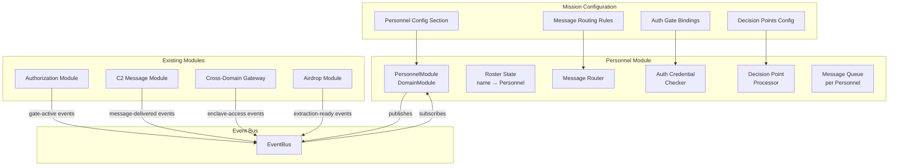
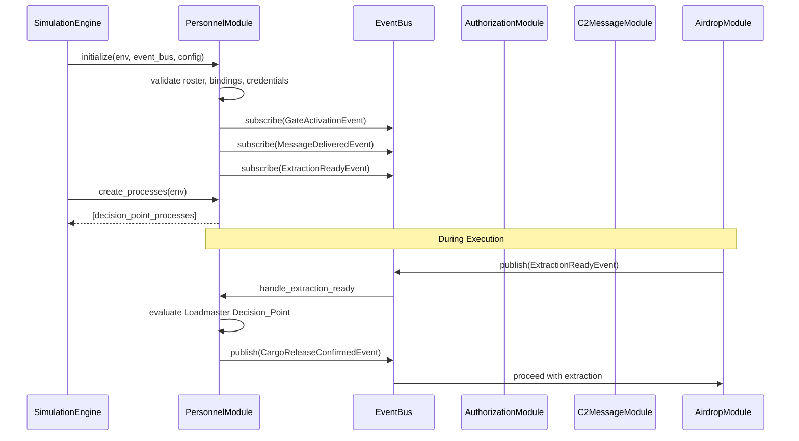

# Design Document: Personnel Module

## Overview

This design describes the Personnel Module, a new domain module that introduces named human actors into the simulation. Personnel are modeled as agents with roles, credentials, duty stations, and readiness states. They bind abstract authorization gates, C2 messages, and airdrop decisions to specific individuals, enabling the simulation to capture realistic human-in-the-loop decision-making, role-based message routing, and per-person access control.

The module extends the existing DomainModule interface and integrates with Authorization, C2 Message, Cross-Domain Gateway, and Airdrop modules through the synchronous EventBus. Its primary responsibilities are:

1. **Personnel lifecycle** — Maintain a roster of personnel with readiness state tracking
2. **Decision point modeling** — Gate mission flow through personnel decisions with configurable deliberation time
3. **Role-based message routing** — Route C2 messages to personnel based on role and duty station
4. **Authorization gate binding** — Map authorization gates to specific approving personnel
5. **Network authentication** — Enforce per-person credential-based access to security enclaves
6. **Airdrop integration** — Require loadmaster confirmation before cargo extraction

### Key Design Decisions

1. **Personnel as Agent subclass** — Personnel extend the ontology-aligned `Agent` base class, maintaining alignment with the BFO/CCO hierarchy while adding personnel-specific fields.
2. **Event-driven integration** — The personnel module subscribes to events from other modules (e.g., `ExtractionStartEvent` from Airdrop) and publishes personnel-specific events, avoiding tight coupling.
3. **Decision points as SimPy processes** — Each active decision point is modeled as a SimPy process that consumes simulation time for deliberation, enabling natural composition with the existing scheduling model.
4. **Message queue per personnel** — Messages destined for non-READY personnel are queued and delivered on state transition, preserving message ordering and supporting delayed delivery semantics.
5. **Configuration-driven role resolution** — All personnel-role-gate-message bindings are declarative in the MissionConfiguration, requiring no code changes for different mission scenarios.
6. **Clearance level ordering as enum with integer comparison** — Clearance levels use an IntEnum for natural ordering (UNCLASSIFIED < SECRET < TOP_SECRET), enabling simple comparison-based access checks.

## Architecture



### Module Dependencies

```python
module_type: ClassVar[str] = "personnel"
dependencies: ClassVar[Set[str]] = {"authorization", "c2_message", "cross_domain", "airdrop"}
```

The personnel module depends on all modules it integrates with for initialization ordering. This ensures authorization chains, C2 message types, cross-domain enclaves, and airdrop parameters are validated before personnel bindings reference them.

### Integration Sequence



## Components and Interfaces

### PersonnelModule (DomainModule Implementation)

```python
class PersonnelModule(DomainModule):
    """Domain module modeling individual personnel in mission execution."""

    module_type: ClassVar[str] = "personnel"
    dependencies: ClassVar[Set[str]] = {"authorization", "c2_message", "cross_domain", "airdrop"}

    def initialize(self, env: simpy.Environment, event_bus: EventBus,
                   config: MissionConfiguration) -> None:
        """Load personnel roster, validate bindings, subscribe to events."""
        ...

    def create_processes(self, env: simpy.Environment) -> list[simpy.events.Process]:
        """Create SimPy processes for active decision points and message queue delivery."""
        ...

    def finalize(self) -> None:
        """Clear roster state, queues, and subscriptions."""
        ...

    def validate_config(self, config: MissionConfiguration) -> list[str]:
        """Validate personnel config cross-references against other modules."""
        ...
```

### Decision Point Processor

```python
class DecisionPointProcessor:
    """Manages decision point evaluation as SimPy processes."""

    def trigger_decision(self, decision_id: str, env: simpy.Environment) -> simpy.Event:
        """Start a decision point evaluation. Returns a SimPy event that
        resolves with the DecisionOutcome when deliberation completes."""
        ...

    def get_assigned_personnel(self, decision_id: str) -> Personnel | None:
        """Resolve the READY personnel member for a decision point's assigned role.
        Returns first match in roster order, or None if no READY member found."""
        ...
```

### Message Router

```python
class MessageRouter:
    """Routes C2 messages to personnel based on role and duty station."""

    def resolve_recipient(self, message_type: str, destination_node: str) -> Personnel | None:
        """Find the personnel member at destination_node with the role
        matching the routing rule for this message type."""
        ...

    def resolve_sender(self, message_type: str, source_node: str) -> Personnel | None:
        """Find the personnel member at source_node with the role
        matching the routing rule for this message type."""
        ...

    def queue_message(self, message_type: str, personnel_name: str, timestamp: float) -> None:
        """Queue a message for later delivery when personnel becomes READY."""
        ...
```

### Credential Checker

```python
class CredentialChecker:
    """Validates personnel credentials against enclave access requirements."""

    def check_enclave_access(self, personnel: Personnel, enclave_name: str) -> bool:
        """Check if personnel's credential authorizes access to the named enclave."""
        ...

    def check_clearance_level(self, personnel: Personnel, required_level: str) -> bool:
        """Check if personnel's clearance meets or exceeds the required level."""
        ...
```

## Data Models

### Personnel Model

```python
from enum import Enum, IntEnum
from pydantic import BaseModel, Field, field_validator
from typing import Optional
from enterprise_sim.models.base import Agent


class ReadinessState(str, Enum):
    """Personnel availability status."""
    READY = "READY"
    UNAVAILABLE = "UNAVAILABLE"
    INCAPACITATED = "INCAPACITATED"


class ClearanceLevel(IntEnum):
    """Security clearance levels with natural ordering."""
    UNCLASSIFIED = 0
    SECRET = 1
    TOP_SECRET = 2


class CredentialType(str, Enum):
    """Authentication mechanism types."""
    CAC_PKI = "CAC_PKI"


class AuthenticationCredential(BaseModel):
    """Personnel authentication credential for enclave access."""
    credential_type: CredentialType
    clearance_level: ClearanceLevel
    authorized_enclaves: list[str] = Field(..., min_length=1)


class Personnel(Agent):
    """A named individual with role, duty station, credential, and readiness."""
    entity_type: str = "personnel"
    name: str = Field(..., min_length=1, max_length=128)
    role: str
    duty_station: str
    credential: AuthenticationCredential
    readiness_state: ReadinessState = ReadinessState.READY

    @field_validator("name")
    @classmethod
    def name_not_blank(cls, v: str) -> str:
        if not v.strip():
            raise ValueError("Personnel name must not be blank")
        return v
```

### Decision Point Model

```python
class DecisionType(str, Enum):
    """Types of decisions personnel can make."""
    GO_NO_GO = "GO_NO_GO"
    APPROVE_DENY = "APPROVE_DENY"
    VERIFY_REJECT = "VERIFY_REJECT"


class DecisionOutcome(str, Enum):
    """Possible outcomes of a decision point evaluation."""
    APPROVE = "APPROVE"
    DENY = "DENY"
    DEFER = "DEFER"


class DecisionPointConfig(BaseModel):
    """Configuration for a single decision point."""
    decision_id: str = Field(..., min_length=1)
    assigned_role: str
    decision_type: DecisionType
    deliberation_duration: float = Field(..., gt=0)
    timeout: Optional[float] = Field(None, gt=0)
```

### Message Routing Rule Model

```python
class MessageRoutingRule(BaseModel):
    """Maps a C2 message type to a responsible Personnel Role."""
    message_type: str
    destination_role: str
```

### Authorization Gate Binding Model

```python
class AuthorizationGateBinding(BaseModel):
    """Maps an authorization gate to the Personnel Role that approves it."""
    gate_name: str
    approving_role: str
```

### Personnel Configuration Section

```python
class PersonnelConfig(BaseModel):
    """Personnel section of the MissionConfiguration."""
    roster: list[Personnel] = Field(..., min_length=1, max_length=100)
    message_routing_rules: list[MessageRoutingRule] = Field(default_factory=list)
    authorization_gate_bindings: list[AuthorizationGateBinding] = Field(default_factory=list)
    decision_points: list[DecisionPointConfig] = Field(default_factory=list)

    @field_validator("roster")
    @classmethod
    def unique_names(cls, v: list[Personnel]) -> list[Personnel]:
        names = [p.name for p in v]
        duplicates = [n for n in names if names.count(n) > 1]
        if duplicates:
            raise ValueError(f"Duplicate personnel names: {set(duplicates)}")
        return v
```

### Personnel Event Types

```python
# === Readiness events ===

class ReadinessChangedEvent(SimulationEvent):
    """Published when a personnel member's readiness state changes."""
    event_type: str = "readiness_changed"
    personnel_name: str
    previous_state: str
    new_state: str


class AssignmentRejectedEvent(SimulationEvent):
    """Published when a decision assignment is rejected due to readiness."""
    event_type: str = "assignment_rejected"
    personnel_name: str
    readiness_state: str
    decision_id: str


# === Decision events ===

class DecisionRenderedEvent(SimulationEvent):
    """Published when a decision point evaluation completes."""
    event_type: str = "decision_rendered"
    decision_id: str
    personnel_name: str
    decision_type: str
    outcome: str


class DecisionDeferredEvent(SimulationEvent):
    """Published when a decision is deferred (no READY personnel or state change)."""
    event_type: str = "decision_deferred"
    decision_id: str
    personnel_name: Optional[str] = None
    readiness_state: Optional[str] = None
    assigned_role: Optional[str] = None


class DecisionTimeoutEvent(SimulationEvent):
    """Published when a decision point timeout expires."""
    event_type: str = "decision_timeout"
    decision_id: str
    assigned_role: str


class MissionBlockedEvent(SimulationEvent):
    """Published when a DENY decision blocks mission flow."""
    event_type: str = "mission_blocked"
    decision_id: str
    blocking_personnel: str
    reason: str


# === Message routing events ===

class MessageReceivedEvent(SimulationEvent):
    """Published when a message is successfully routed to personnel."""
    event_type: str = "message_received"
    message_type: str
    recipient_name: str
    recipient_role: str


class MessageUnroutedEvent(SimulationEvent):
    """Published when no routing rule exists for a delivered message."""
    event_type: str = "message_unrouted"
    message_type: str
    destination_node: str


class MessageDelayedEvent(SimulationEvent):
    """Published when message delivery is delayed due to readiness."""
    event_type: str = "message_delayed"
    message_type: str
    personnel_name: str
    readiness_state: str


class MessageUnroutableEvent(SimulationEvent):
    """Published when no personnel at destination matches routing rule."""
    event_type: str = "message_unroutable"
    message_type: str
    expected_role: str
    destination_node: str


class SenderUnresolvedEvent(SimulationEvent):
    """Published when sender personnel cannot be resolved."""
    event_type: str = "sender_unresolved"
    message_type: str
    source_node: str


class ReceiverUnresolvedEvent(SimulationEvent):
    """Published when receiver personnel cannot be resolved."""
    event_type: str = "receiver_unresolved"
    message_type: str
    destination_node: str


# === Authorization gate events ===

class GateBlockedEvent(SimulationEvent):
    """Published when a gate is blocked waiting for READY personnel."""
    event_type: str = "gate_blocked"
    gate_name: str
    required_role: str


class GateTimeoutPersonnelEvent(SimulationEvent):
    """Published when a gate times out waiting for personnel."""
    event_type: str = "gate_timeout_personnel"
    gate_name: str
    required_role: str


# === Credential/access events ===

class AccessDeniedEvent(SimulationEvent):
    """Published when personnel credential does not authorize enclave access."""
    event_type: str = "access_denied"
    personnel_name: str
    credential_type: str
    denied_enclave: str


class AuthenticationSuccessEvent(SimulationEvent):
    """Published when personnel successfully authenticates to an enclave."""
    event_type: str = "authentication_success"
    personnel_name: str
    enclave_name: str


class ClearanceInsufficientEvent(SimulationEvent):
    """Published when personnel clearance is below enclave classification."""
    event_type: str = "clearance_insufficient"
    personnel_name: str
    personnel_clearance: str
    enclave_name: str
    required_classification: str


# === Airdrop integration events ===

class CargoReleaseConfirmedEvent(SimulationEvent):
    """Published when loadmaster approves cargo release."""
    event_type: str = "cargo_release_confirmed"
    loadmaster_name: str
    drop_zone_node: str


class CargoReleaseDeniedEvent(SimulationEvent):
    """Published when loadmaster denies cargo release."""
    event_type: str = "cargo_release_denied"
    loadmaster_name: str
    drop_zone_node: str
```


## Correctness Properties

*A property is a characteristic or behavior that should hold true across all valid executions of a system — essentially, a formal statement about what the system should do. Properties serve as the bridge between human-readable specifications and machine-verifiable correctness guarantees.*

### Property 1: Personnel Configuration Round-Trip

*For any* valid PersonnelConfig object (including roster, message routing rules, authorization gate bindings, and decision points), serializing to JSON and deserializing SHALL produce an object with field-by-field equality to the original.

**Validates: Requirements 1.9, 9.4**

### Property 2: Roster Unique Name Validation

*For any* Personnel_Roster containing two or more Personnel entries with the same name, validation SHALL reject the roster and return an error identifying the duplicated name(s).

**Validates: Requirements 1.3, 1.5**

### Property 3: Roster Size Validation

*For any* Personnel_Roster with zero entries or more than 100 entries, validation SHALL reject the roster. For any roster with 1 to 100 entries (all otherwise valid), validation SHALL accept it.

**Validates: Requirements 1.2, 1.6**

### Property 4: Role Validation Against Configuration

*For any* Personnel entry whose role value is not in the set of recognized roles defined in the MissionConfiguration, validation SHALL reject the entry and identify the personnel name and unrecognized role.

**Validates: Requirements 1.4, 1.7**

### Property 5: Duty Station Cross-Reference Validation

*For any* Personnel entry whose duty_station does not match a node name in the RouteGraph, validation SHALL reject the entry and identify the personnel name and unrecognized duty_station.

**Validates: Requirements 1.8**

### Property 6: Readiness State Transition Event Publication

*For any* Personnel member and any valid readiness state transition (from one ReadinessState to a different ReadinessState), the module SHALL publish a readiness-changed event containing the personnel name, previous state, new state, and current simulation timestamp.

**Validates: Requirements 2.2**

### Property 7: Non-READY Personnel Rejects Decision Assignment

*For any* Personnel member in UNAVAILABLE or INCAPACITATED state and any Decision_Point, attempting to assign the decision to that member SHALL be rejected, and an assignment-rejected event SHALL be published containing the personnel name, current readiness state, and decision_id.

**Validates: Requirements 2.3**

### Property 8: Invalid Readiness State Transition Preserves Current State

*For any* Personnel member and any state value not in {READY, UNAVAILABLE, INCAPACITATED}, requesting a transition to that value SHALL be rejected, the member's readiness state SHALL remain unchanged, and an error SHALL identify the invalid value.

**Validates: Requirements 2.5**

### Property 9: In-Progress Decision Deferred on Readiness Loss

*For any* Personnel member who is the assigned actor for an in-progress Decision_Point, if that member's readiness state transitions to UNAVAILABLE or INCAPACITATED, the Decision_Point outcome SHALL be set to DEFER and a decision-deferred event SHALL be published containing the decision_id, personnel name, and new readiness state.

**Validates: Requirements 2.6**

### Property 10: Decision Point Role Resolution (Roster Order)

*For any* Decision_Point with an assigned_role where multiple Personnel members have that role, the module SHALL select the first member in Personnel_Roster order whose readiness state is READY.

**Validates: Requirements 3.2**

### Property 11: Decision Evaluation Timing and Event

*For any* Decision_Point with a configured deliberation_duration, evaluation SHALL consume exactly that duration in simulation time, and upon completion SHALL publish a decision-rendered event containing the decision_id, personnel name, decision_type, outcome, and simulation timestamp.

**Validates: Requirements 3.3, 3.4**

### Property 12: DENY Outcome Publishes Mission-Blocked Event

*For any* Decision_Point whose outcome is DENY, the module SHALL publish a mission-blocked event containing the decision_id, blocking personnel name, and reason.

**Validates: Requirements 3.5**

### Property 13: Decision Deferral and Timeout

*For any* Decision_Point where no Personnel member with the assigned_role is in READY state, the module SHALL defer evaluation. If the configurable timeout expires without a READY member becoming available, the outcome SHALL be set to DEFER and a decision-timeout event SHALL be published containing the decision_id and assigned_role.

**Validates: Requirements 3.6, 3.7**

### Property 14: Duplicate Decision ID Validation

*For any* personnel configuration containing two or more Decision_Points with the same decision_id, validation SHALL reject the configuration and identify the duplicated decision_id.

**Validates: Requirements 3.9**

### Property 15: Message Routing Rule Cross-Reference Validation

*For any* Message_Routing_Rule that references a message type not defined in c2_messages configuration or a role not present in the Personnel_Roster, validation SHALL reject the rule and identify the invalid reference.

**Validates: Requirements 4.1**

### Property 16: Message Routing to Correct Personnel

*For any* C2 message delivered to a destination node, and any Message_Routing_Rule matching that message type, the module SHALL identify the Personnel member at that duty_station whose role matches the rule's destination_role, and publish a message-received event with message type, recipient name, recipient role, and timestamp.

**Validates: Requirements 4.2, 4.3**

### Property 17: Missing Routing Rule Publishes Unrouted Event

*For any* C2 message type delivered to a destination node where no Message_Routing_Rule exists for that message type, the module SHALL accept the message and publish a message-unrouted event containing the message type, destination node, and timestamp.

**Validates: Requirements 4.4**

### Property 18: Non-READY Recipient Queues Message

*For any* C2 message routed to a Personnel member who is not in READY state, the module SHALL queue the message, publish a message-delayed event (with message type, personnel name, readiness state, and timestamp), and deliver the message when the member transitions to READY with the actual delivery timestamp.

**Validates: Requirements 4.5, 4.6**

### Property 19: No Matching Personnel Publishes Unroutable Event

*For any* C2 message delivered to a destination node where no Personnel member at that node has a role matching the Message_Routing_Rule, the module SHALL publish a message-unroutable event containing the message type, expected role, and destination node.

**Validates: Requirements 4.7**

### Property 20: Authorization Gate Binding Validation

*For any* Authorization_Gate_Binding that references a gate name not defined in the authorization_chain configuration or a role not present in the Personnel_Roster, validation SHALL reject the binding and identify the unmatched gate/role.

**Validates: Requirements 5.1, 5.5**

### Property 21: Gate Personnel Readiness Check

*For any* authorization gate that becomes active with a bound role, if no Personnel member with that role is in READY state, the module SHALL publish a gate-blocked event (with gate name, required role, and timestamp) and block gate processing. If a READY member exists, gate processing proceeds. If the gate timeout expires while blocked, a gate-timeout event SHALL be published and the gate SHALL transition to a failed state.

**Validates: Requirements 5.2, 5.4, 5.6**

### Property 22: Gate Approval Records Personnel

*For any* authorization gate that is approved, the gate completion event published to the Event_Bus SHALL contain the approving personnel name.

**Validates: Requirements 5.3**

### Property 23: Enclave Access Enforcement

*For any* Personnel member initiating cross-domain communication, if the destination enclave is NOT in the member's authorized_enclaves, the communication SHALL be blocked, the message discarded, and an access-denied event published (with personnel name, credential_type, denied enclave, and timestamp). If the enclave IS authorized, an authentication-success event SHALL be published.

**Validates: Requirements 6.2, 6.3, 6.4**

### Property 24: Clearance Level Ordering Enforcement

*For any* Personnel member whose clearance_level is below the destination enclave's classification_level (according to UNCLASSIFIED < SECRET < TOP_SECRET), access SHALL be blocked and a clearance-insufficient event SHALL be published containing the personnel name, personnel clearance, enclave name, and required classification level.

**Validates: Requirements 6.5**

### Property 25: Authorized Enclaves Cross-Reference Validation

*For any* Personnel member whose authorized_enclaves list includes an enclave name not defined in the Cross_Domain_Gateway configuration, initialization validation SHALL return an error identifying the personnel name and each unrecognized enclave name.

**Validates: Requirements 6.6**

### Property 26: Loadmaster Decision Gates Extraction

*For any* airdrop extraction sequence, the module SHALL require a Decision_Point evaluation from a Personnel member with Loadmaster role at the drop zone node. If outcome is APPROVE, a cargo-release-confirmed event is published and extraction proceeds. If DENY, a cargo-release-denied event is published and extraction does NOT initiate. If no READY Loadmaster exists, extraction is blocked with a decision-deferred event until one becomes READY or timeout expires.

**Validates: Requirements 7.1, 7.2, 7.3, 7.4, 7.5**

### Property 27: Sender Personnel Resolution

*For any* generated C2 message, the module SHALL resolve sender_personnel from the Personnel member at the source node whose role matches the Message_Routing_Rule. If no matching Personnel exists at the source node, sender_personnel SHALL be set to null and a sender-unresolved event SHALL be published.

**Validates: Requirements 8.2, 8.4**

### Property 28: Receiver Personnel Resolution

*For any* delivered C2 message, the module SHALL resolve receiver_personnel from the Personnel member at the destination node whose role matches the Message_Routing_Rule. If no matching Personnel exists at the destination node, receiver_personnel SHALL be set to null and a receiver-unresolved event SHALL be published.

**Validates: Requirements 8.3, 8.5**

### Property 29: Configuration Validation Error Aggregation

*For any* personnel configuration section with multiple constraint violations (including cross-reference violations against authorization_chain, c2_messages, and cross_domain_gateway), validation SHALL return all errors found, not just the first encountered.

**Validates: Requirements 9.2**

## Error Handling

### Validation Errors (Initialization Phase)

All configuration validation errors are collected and returned as an aggregated list during the `validate_config` call. The module does not fail-fast on the first error; it reports all discoverable issues.

| Error Category | Trigger | Response |
|---|---|---|
| Empty/absent roster | Personnel section missing or roster empty | Return error: "Personnel roster requires at least one entry" |
| Roster overflow | More than 100 personnel entries | Return error: "Personnel roster exceeds maximum of 100 entries" |
| Duplicate names | Two or more personnel share a name | Return error: "Duplicate personnel name: {name}" |
| Invalid role | Role not in recognized role set | Return error: "Personnel '{name}' has unrecognized role: {role}" |
| Invalid duty station | Duty station not in route graph | Return error: "Personnel '{name}' references unknown duty_station: {station}" |
| Invalid enclave reference | Authorized enclave not in gateway config | Return error: "Personnel '{name}' references unknown enclave: {enclave}" |
| Invalid gate binding | Gate name not in authorization chain | Return error: "Gate binding references unknown gate: {gate}" |
| Invalid routing rule | Message type or role not in config | Return error: "Routing rule references unknown message type: {type}" |
| Duplicate decision_id | Two decision points share an ID | Return error: "Duplicate decision_id: {id}" |
| Invalid deliberation_duration | Zero or negative value | Return error: "Decision '{id}' has invalid deliberation_duration: {value}" |

### Runtime Errors (Execution Phase)

Runtime errors are handled via event publication rather than exceptions, maintaining simulation continuity.

| Error Category | Trigger | Response |
|---|---|---|
| Decision assignment to non-READY | Personnel not available | Publish assignment-rejected event, do not assign |
| Invalid state transition | Unrecognized readiness state value | Reject transition, preserve current state, return error |
| In-progress decision interrupted | Personnel becomes non-READY mid-decision | Set outcome to DEFER, publish decision-deferred event |
| Decision timeout | No READY personnel within timeout | Set outcome to DEFER, publish decision-timeout event |
| Gate blocked | No READY personnel for gate role | Publish gate-blocked event, block processing |
| Gate timeout | Timeout expires while blocked | Publish gate-timeout event, gate transitions to failed |
| Access denied | Personnel lacks enclave authorization | Block communication, discard message, publish access-denied |
| Clearance insufficient | Clearance below enclave classification | Block access, publish clearance-insufficient event |
| Message unroutable | No matching personnel at destination | Publish message-unroutable event |
| Message delayed | Recipient not READY | Queue message, publish message-delayed event |

## Testing Strategy

### Property-Based Testing (Hypothesis)

The project already uses the [Hypothesis](https://hypothesis.readthedocs.io/) library for property-based testing (evidenced by the `.hypothesis/` directory in the workspace). All correctness properties will be implemented as Hypothesis tests with a minimum of 100 iterations.

**Configuration:**
```python
from hypothesis import given, settings, HealthCheck
from hypothesis import strategies as st

@settings(max_examples=100, suppress_health_check=[HealthCheck.too_slow])
```

**Tag format for each property test:**
```python
# Feature: personnel-module, Property {N}: {property_text}
```

**Custom Strategies:**
- `personnel_strategy()` — Generates random valid Personnel instances
- `roster_strategy()` — Generates valid rosters (1-100 entries, unique names)
- `decision_point_strategy()` — Generates valid DecisionPointConfig instances
- `credential_strategy()` — Generates random AuthenticationCredential instances
- `personnel_config_strategy()` — Generates complete PersonnelConfig instances

### Unit Tests (pytest)

Example-based tests for specific scenarios:

- Default readiness state initialization (Req 2.4)
- Mission configuration schema accepts personnel section (Req 9.1)
- Complete message delivery record includes sender/receiver (Req 8.6)
- Personnel section absent with module active raises error (Req 9.3)

### Integration Tests

Integration tests verify cross-module behavior:

- Personnel module initializes in correct order relative to dependencies
- Decision point blocks airdrop extraction sequence end-to-end
- Message routing integrates with C2 message delivery
- Credential check integrates with cross-domain gateway transit
- Authorization gate binding integrates with authorization chain processing

### Test Organization

```
tests/
├── test_personnel_models.py          # Pydantic model validation
├── test_personnel_module.py          # Module lifecycle and integration
├── test_personnel_decisions.py       # Decision point logic
├── test_personnel_routing.py         # Message routing
├── test_personnel_credentials.py     # Authentication and access control
├── test_personnel_properties.py      # All property-based tests
└── conftest.py                       # Shared fixtures and strategies
```
